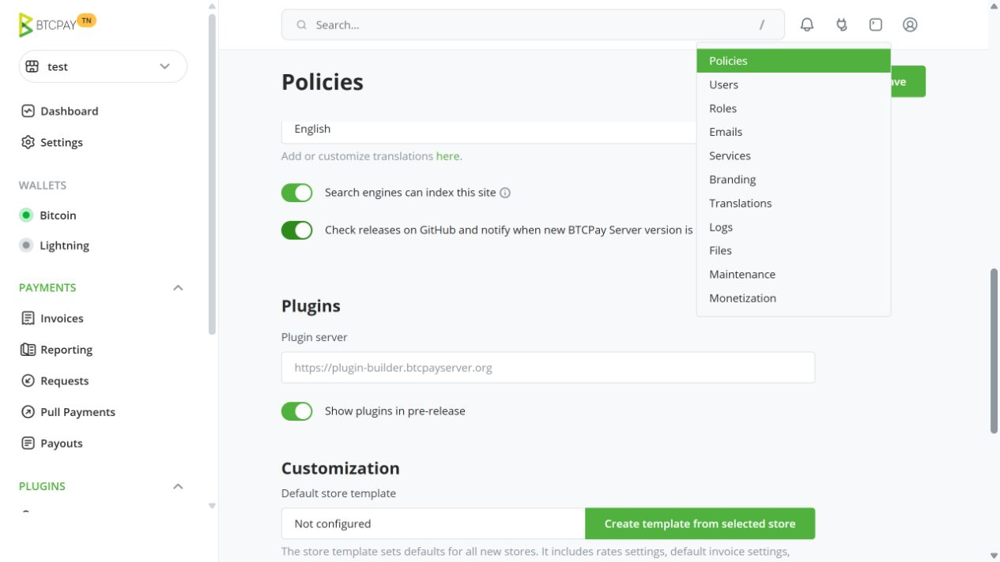
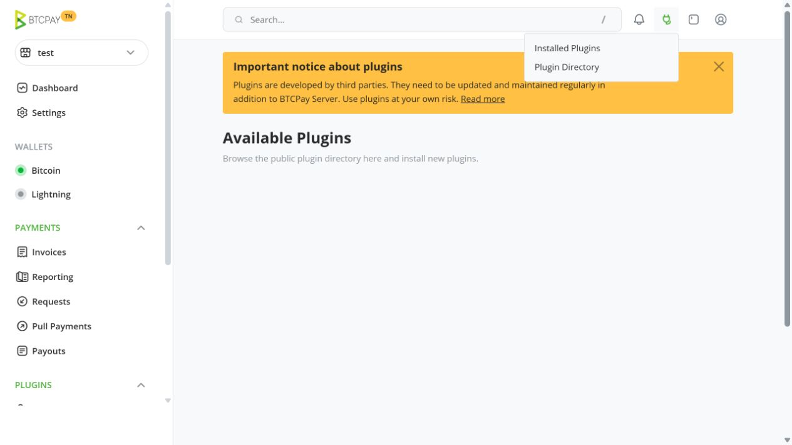
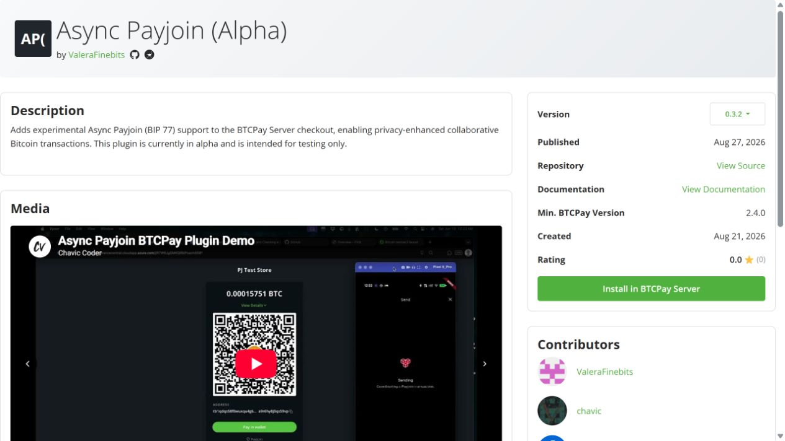
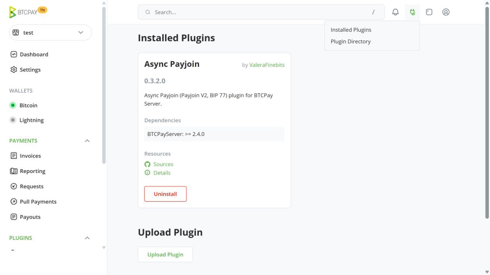
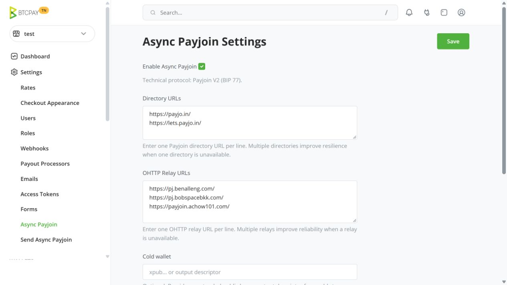
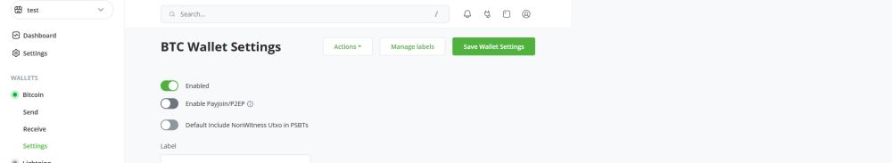
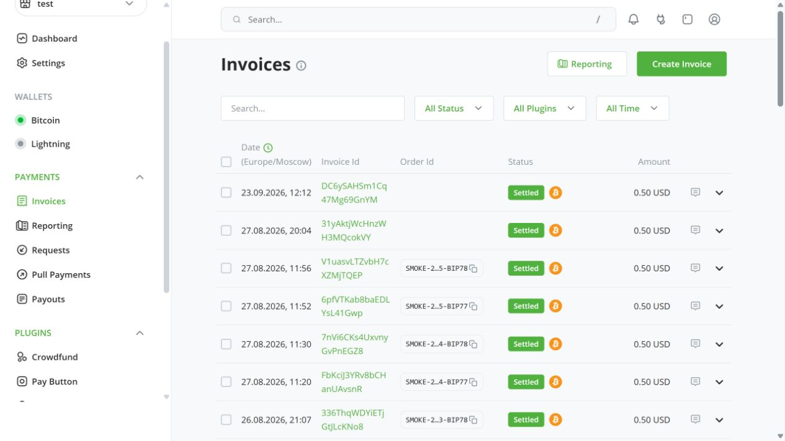
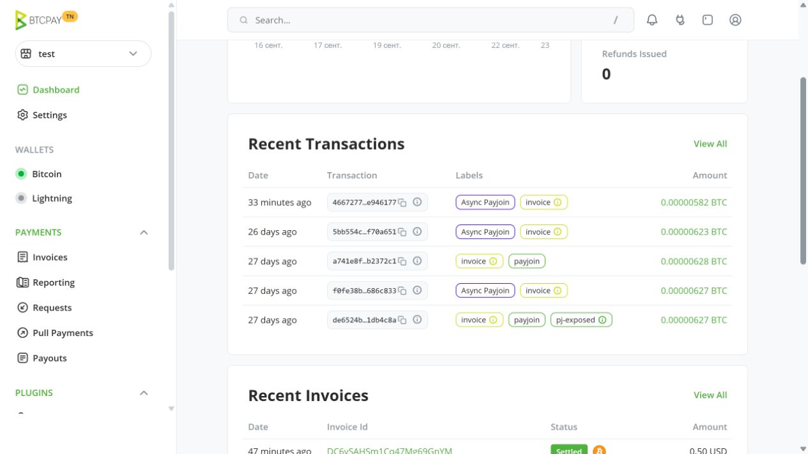

# Install Async Payjoin (Alpha)

> [!WARNING]
> Test on a separate BTCPay Server instance with funds you can afford to lose. This alpha can disrupt payments or lose funds; a separate store on a production instance is not isolation.

Installation requires server administrator access and BTCPay Server 2.4.0 or later.

## Install

1. Open the top-right **Server Settings → Policies** menu. Enable **Show plugins in pre-release** and save.

   

2. Open the top-right **Plugins → Plugin Directory** menu. Find **Async Payjoin (Alpha)** by **ValeraFinebits**; if this unlisted release is absent, open its [plugin page](https://plugin-builder.btcpayserver.org/public/plugins/async-payjoin) directly.

   

3. On the plugin page, select **Install in BTCPay Server → Install → Restart now**. When BTCPay returns, open **Plugins → Installed Plugins** and check the author and version.

   

   

Async Payjoin is enabled by default for stores without saved plugin settings. Disable it in stores outside this test.

## Prepare a store

1. The receiving store needs a **hot Bitcoin wallet** with a backed-up recovery phrase and at least one confirmed, spendable native SegWit or Taproot UTXO. A watch-only wallet cannot sign the receiver's inputs. For a new wallet, follow [BTCPay's hot-wallet setup](https://docs.btcpayserver.org/CreateWallet/) and keep the default Segwit address type.
2. In the receiving store's left sidebar, open **Settings → Async Payjoin**. Enable it, keep the default **Directory URLs** and **OHTTP Relay URLs**, leave **Cold wallet** and **Maximum fee rate** empty, and save.

   

3. Open **Wallets → Bitcoin → Settings**, turn off **Enable Payjoin/P2EP**, and save. This prevents checkout's built-in Payjoin v1 fallback. Then open **Plugins → Async Payjoin** in the left sidebar and check for **Basic prerequisites present** and confirmed receiver inputs. The overview does not test directory or relay reachability.

   

## Test a payment

1. Open **Payments → Invoices → Create Invoice** and select **Async Payjoin** at checkout. Scan the QR code or open the full `bitcoin:` URI in your own BIP 77 wallet on the same Bitcoin network. Copying only the address omits Payjoin data.

   

2. Send a payment. On the receiving store's **Dashboard → Recent Transactions**, find the matching transaction labeled **Async Payjoin**. In RC2 this label confirms Payjoin but does not distinguish v1 from v2; use your sending wallet's result to confirm v2. The invoice settles after the required confirmations.

   

If **Async Payjoin** is missing at checkout, check the store settings and overview. For help, [report an issue](https://github.com/ValeraFinebits/btcpayserver-payjoin-plugin/issues) with server/plugin versions, network, sender wallet, and reproduction steps; remove sensitive data from logs. Report vulnerabilities privately through [SECURITY.md](../SECURITY.md).
